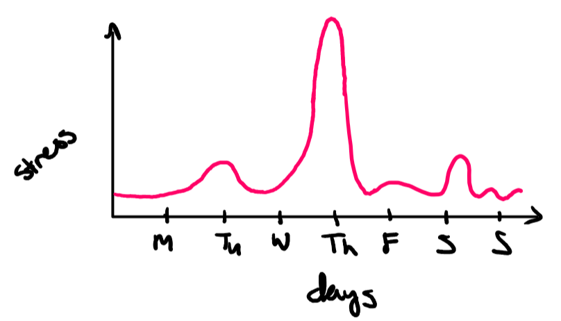

ICS 314: Software Engineering I. I've heard its name in passing but hadn't given it much thought until I was doing registration for the Fall semester. "It'll be lots of work, but I learned a lot" was my friend's take on the course. Glancing over the course description I was inclined to agree, so I registered for my first course in the ICS department. 

Fast forward to August 24, 2023, i.e. first in-person class. I walked into the chilly POST 319 and was greeted by a sea of faces I didn't recognize. I proceeded to take an empty seat near the front of the room, and with each step, my nerves doubled. Then the professor started the class with "Welcome to the icebox," and I knew this class was going to be memorable if nothing else.

## Premonitions of suffering: ASE and WODs

Athletic Software Engineering (ASE) is a programming pedagogy that focuses on building a student's competency by actively exercising necessary skills. WODs, or Workout of the Day, are the main way we do this. WODs are timed pass/fail exercises that try to get students to efficiently and effectively apply the skills they are learning. Let me emphasize: **PASS/FAIL**. No partial credit and no retries. This means once a week my stress levels skyrocket. I've included a graph of my predicted stress levels throughout the week due to this class for illustrative purposes. 
While I do agree with the ASE learning method, and think it closely fits my personal learning style, I don't know if my heart can take it. Despite a few failed WODs that are surely waiting for me ahead, I can only move forward. Even now as I prepare for my upcoming WOD, I find myself trying to put faith in the experience I've gained from completing a few practice WODs. 

## The sacred (Java)Script brings hope
Although the future is looking bleak, some hope came in the form of JavaScript. Until now, I have learned a variety of languages ranging from Assembly to Python. If I was to compare JavaScript to one of the languages I've learned before, I would say it most closely resembles Python, but isn't quite the same. While I only have a basic understanding of the language, it is quickly becoming one of my favorites.

### The good,
In particular I love its flexibility combined with simplicity. An example of this is the return value of a function. Unlike C or C++, JavaScripts allows a function to return a variety of values. This allows for a more natural approach to functions. This flexibility isn't limited to return statements, but also extends to variables like arrays. A single array is able to hold a combination of variable types, thereby providing a simple, intuitive way of grouping data.

### The bad,
There are a lot of positives to JavaScript, but it isn't perfect. My first qualm with JavaScript, while not actually a part of the language, is the way it is taught through FreeCodeCamp. Their many mini-lessons were informative, but the short coding exercises were not memorable enough to make the information stick. There were a few interesting and challenging problems such as "[Counting Cards](https://www.freecodecamp.org/learn/javascript-algorithms-and-data-structures/basic-javascript/counting-cards)" which actually solidified concepts in my mind.
While this may be due to my lack of knowledge, I find JavaScript's lack of built-in data structures to be an annoyance. When thinking about a solution to a coding problem I often start by choosing a data structure. Thus, when I want to use a dictionary or hash table, I prefer the C++ way where each is a structure that comes with methods.

### And the ugly
While JavaScript includes interesting features like functions as first-class objects, or destructuring assignments, I find these features confusing or unnecessary. I was left questioning when I would actually need to assign a variable a function. I lack the understanding now, but as I use the language more I hope to uncover the value in these features.

## Where does this path lead?
The path to completing ICS 314 looks like a cold, treacherous mountain trail, but it is not impossible. Though I may end up covered in cuts and bruises, I have decided to continue on this journey.
