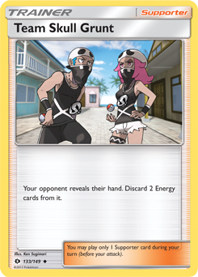

## **Making Sense of Design Patterns through TCG**
Design patterns are a general guide to solving common engineering problems. By "common engineering problems" I mean certain types of problems an engineer repeatedly encounters. For example, in software engineering a common problem is data storage and delivery. Now every project will require a slightly different answer, but a design pattern like the "Model-View-Controller" (MVC) pattern can be used as a guide to solving the problem. I like to imagine them as cards in a deck. Each card is a design pattern we can pull out to solve a problem. Thus while introducing some design patterns I've used in my time as a software engineer, I have corresponding card taken from a different TCG.

*Disclaimer: I don't understand the rules of all these TCGs and chose these cards based on surface level understanding.*

| Design Pattern                  | Card Name         | 
|---------------------------------|-------------------|
| Singleton                       | One for All       | 
| MVC                             | Agent of Mask     |
| Observer (Publish-Subscribe)    | Caduceus          | 
| Observer (Reactive Data)        | Team Skull Grunts | 

   

## **Singleton**

The singleton design pattern is used in a similar way to a global variable. It ensures that only one instance of a class can exist at any given time. This is useful when you want to be able to access data from various places in your code, while also ensuring the integrity of said data. I've used this often when creating and managing databases (i.e. collections) in MongoDB. Each collection has a single instance that is exported as a constant variable.

I've chosen this card card for it's title "One for All". This is a reference to the fact that there is only one instance of the class.

## **Model-View-Controller (MVC)**

The MVC design pattern is used to separate the data, management, and presentation of a program. There are a lot of benefits to such a pattern. Each component is compartmentalized and therefore can be worked on individually. Different people can specialize in different components. It also provides various visualizations of data that can best fit each user's needs. I've used this pattern most recently with a web application I'm working on. The data itself is stored in mongoDB databases, the management is done through Meteor's routing, and the presentation is done through React components.

This card was chosen for it's reference to masks. The MVC pattern is about hiding the inner data from the end user and presenting it in a way that benefits them.

## **Observer (Publish-Subscribe)**

The Publish-Subscribe pattern is a subdivision of the Observer pattern. In this specific pattern there are two parties: the publishers and subscribers. There is also a "middle-man" event bus that bridges these two parties. Whenever there is an update with the publisher, it sends a notification to the event bus. The event bus then notifies any subscriber to the publisher. I've used publications and subscriptions in Meteor to keep collections in mongoDB up-to-date.

I've chosen this card as the caduceus is associated with the Greek god Hermes. Hermes is the messenger of the gods and reminds me of the event bus.

## **Observer (Reactive Data)**

Another subdivision of the Observer pattern is reactive data. In this pattern there are once again two parties: the data and the user. Whenever there is an update to the data, any "user" code will be rerun. I've come across this pattern in a project called "Bowfolios" where a reactive dictionary is used to track when code should be re-run to refresh the UI with new data.

The card I've chosen is "Team Skull Grunts". This is a reference to the fact the reactive element is almost a slave to the data. Whenever it is updated, the reactive element must react. In the same way the grunts of Team Skull must obey their leader.

References: 
[one-for-all.png](https://www.legendarywolfgames.com/product/one-for-all-full-cowling-5-strike/)

[agent-of-masks.jpg](https://gatherer.wizards.com/Pages/Card/Details.aspx?multiverseid=425974)

[caduceus.jpg](https://www.amazon.com/Yu-Gi-Oh-Artifact-Caduceus-PRIO-EN017-Unlimited/dp/B00KY43ECI)

[team-skull-grunts.png](https://www.pokemon.com/us/pokemon-tcg/pokemon-cards/series/sm1/133/)