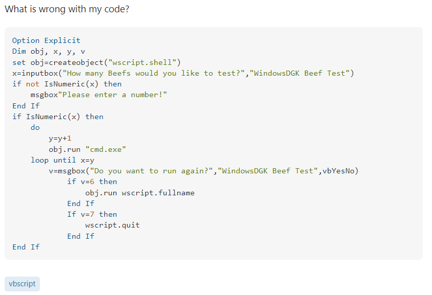
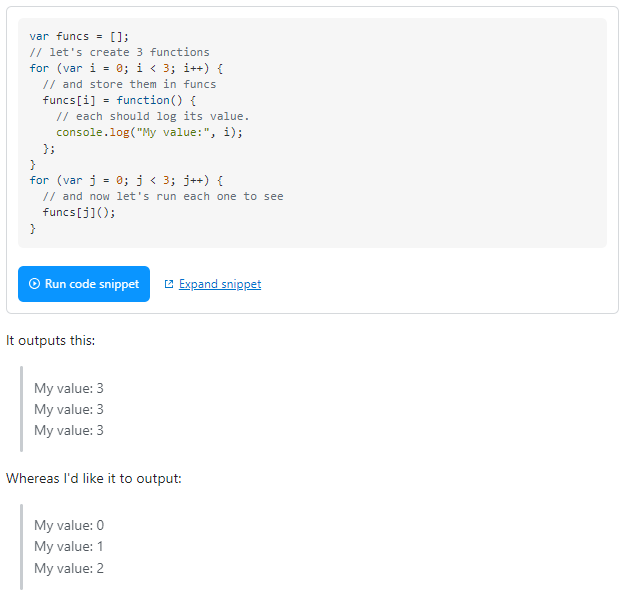

Since we learned how to speak we have been asking questions. I may even argue toddlers' favorite word is "Why." Questions, and their subsequent answers, play a key role in the development of children. In fact, I came across thousands of studies focusing on the various aspects of children's questions, including this [one](https://pubmed.ncbi.nlm.nih.gov/22304406/) (which I found quite interesting). However, this need to ask questions is not limited to children. All of the greatest discoveries in math and science were found because someone dared to question. My personal thoughts on the topic can be summed up in two points: (1) Q&A is a natural approach to learning and therefore (2) asking "great" questions is essential to finding the answers that can expand our knowledge. In this essay I'd like to explore the second point in the context of online forums.

## **What even is a "great" question anyways**
Now a "great" question can be different to everyone, but there are some standards I think we can all agree on. When posing a question, the asker is looking to others to volunteer their time/knowledge to provide help. Thus, it is important to show respect to these people who are willing to help. This can be as simple as using "please" and "thank you." Respect also means not wasting their time. Phrase your question in a way that clearly states the problem. This may mean examples, background, and/or methods you have already tried to find the solution. A well-written question is more likely to get a well-written answer.

Keeping these things in mind, a review of some questions that have been posted to [StackOverflow](https://stackoverflow.com/) should make things clear.

### **An undeniably bad question**
[_"What is wrong with my code in my vbs"_](https://stackoverflow.com/questions/29024582/what-is-wrong-with-my-code-in-my-vbs)

Pros: 
* They tagged it correctly

Cons: 
* The title is vague and provides no context
* "What is wrong with my code?" adds nothing and simply feels like a shout into the void
* Simple copy/paste code can be difficult to understand and often adds unnecessary complexity

This one line question is met with a single sentence answer followed by "You really need to edit you post." This way of asking shows no respect for either party. Additionally, the lack of any proper description means anyone with similar question will probably be unable to find this answer. With the addition of _any_ description this question could be significantly improved. 

### **Getting better...**
Question: [_"UWP Raspberry Pi Webserver Issue"_](https://stackoverflow.com/questions/36502484/uwp-raspberry-pi-webserver-issue/36554862#36554862)

Pros:

* Detailed explanation the problem
* Includes important details about the system being used
* (Not included in the image) They go on to give explanations of solutions they have already tried

Cons: 
* Requires some effort to try to access the sample code

My favorite part about this post is that the asker themselves discovered the solution. Upon doing so they provided a clear writeup and even thanked commenters that pointed them in the right direction. They later came back and added a link to Microsoft's official documentation on the issue. This is a great way to share knowledge, and is one of the greatest benefits of using online forums: your solution can go on to help many others who also encounter the same issue.

### **A great question**
Question: [_"JavaScript closure inside loops – simple practical example"_](https://stackoverflow.com/questions/750486/javascript-closure-inside-loops-simple-practical-example)

Pros:

* Simple but descriptive problem statement
* Interactive and easy to run code
* (Not included in the image) They go on to give explanations and code for other cases where the problem arises.

Cons: 
* Doesn't include any already tried solutions.

This question inspired a wide range of beautifully formatted and detailed solutions. one such solution (shown in the image below) even went as far as to create visuals and explained the underlying concepts. This type of thread provided a great platform for everyone to learn from each other through sharing their knowledge. 

## **Keep asking questions!**
While every question may not be a great question, it is important to keep asking. It is through experience that we can improve our questioning skills. As the Amoeba Sisters, who got me through AP Bio, like to say, "Stay curious." 