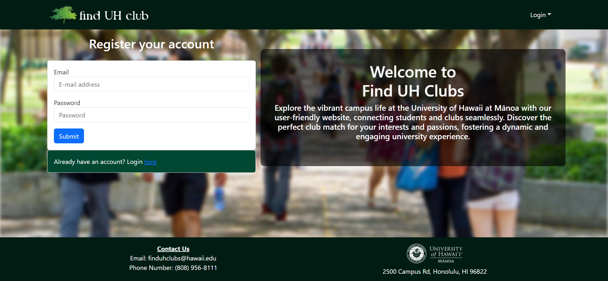
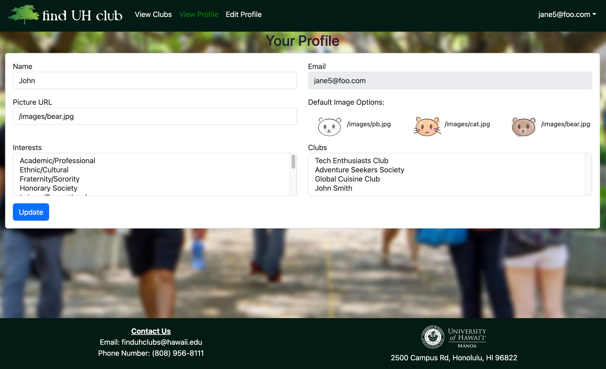
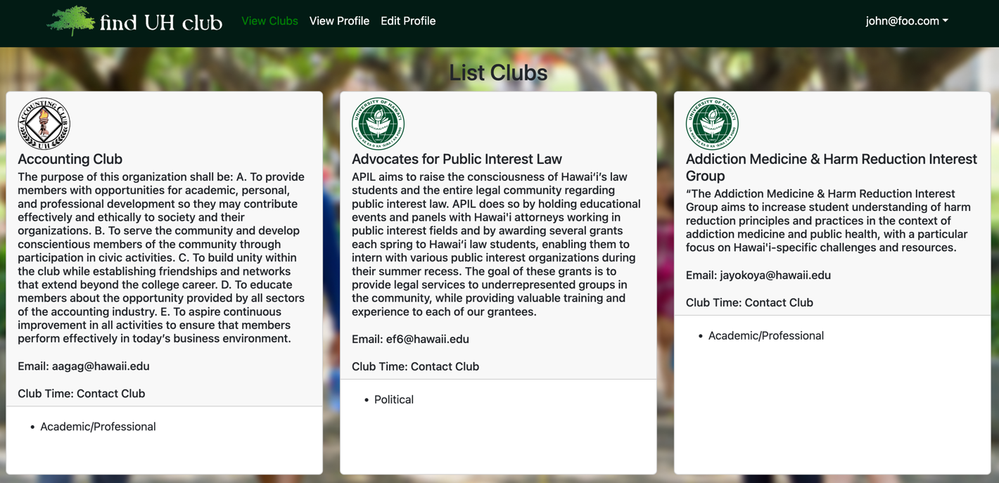
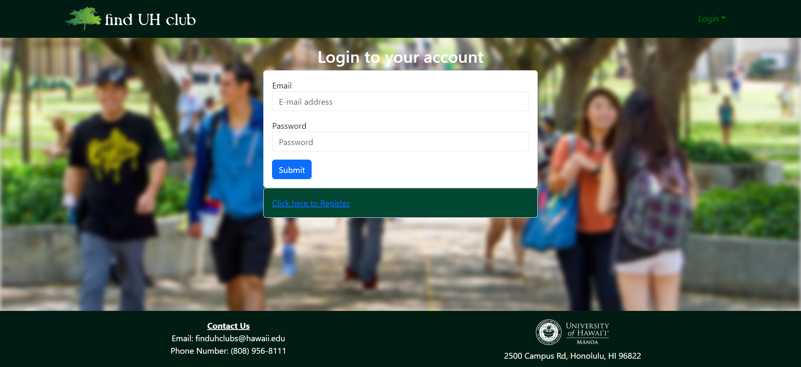
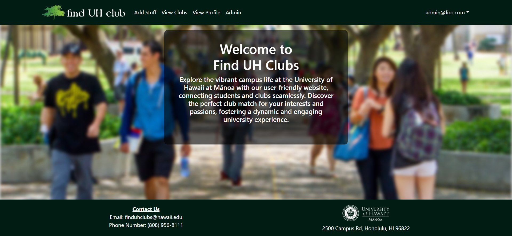
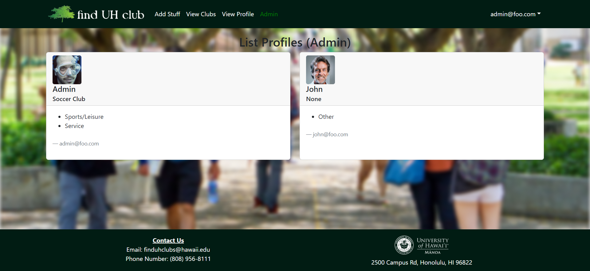
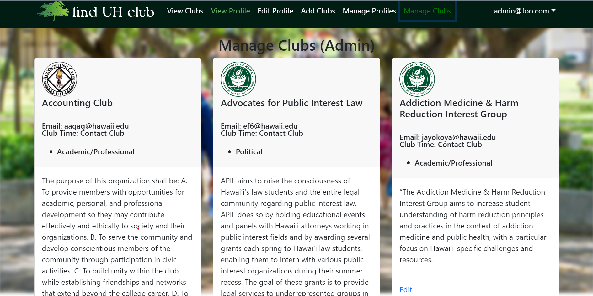
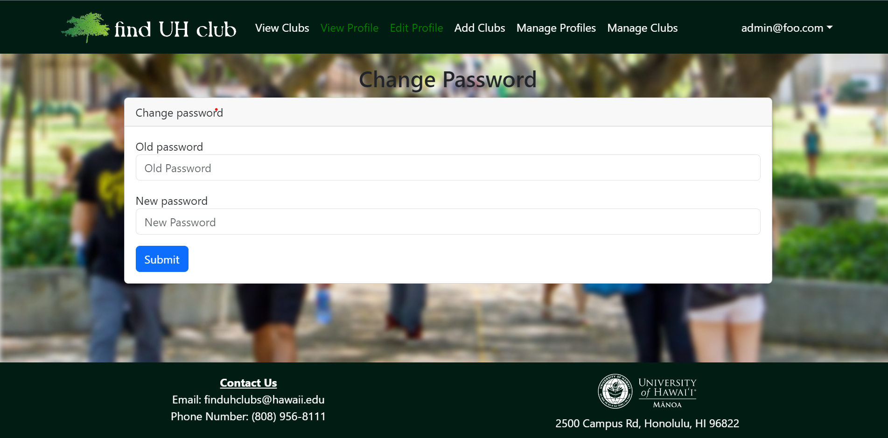
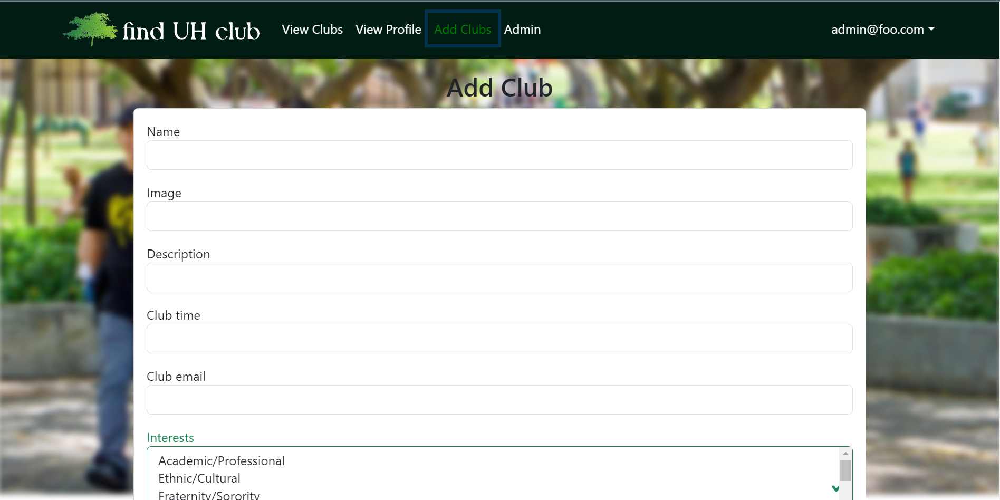

## Background
The University of Hawaii at Manoa has over 200 registered student organizations. However, the only way to view all these organizations is on a google sheet managed by the university. It is an uninviting, overwhelming, and generally unappealing way to present these great organizations. The find UH club web app aims to solve this problem by providing a platform for students to search for organizations based on their interests. It aims to provided an inviting and easy-to-use interface for students and organizations to connect.

## The App
The app is built mainly using Meteor and React. Meteor naturally lends itself to MongoDB, so we used that for our databases. Main features of the app include:
- User profiles 

- List of all organizations
- Filters by interest 

## My Role
Over the course of the project, I have work on various parts of the app. I began with prototyping the datastructures for student profiles. This naturally led to me creating the mongoDB databases. After our first milestone, we realized the need to update the database structure to included joining collections. For example one collection held profiles while the other held all interests. We needed a database to assist in tracking which interests a user had (interest-profile collection)

From a non-technical perspective, I took on the responsibilities similar to that of a project manager. I organized our discord chat for communications, checked in on the various progress of team members and facilitated necessary discussions. While I am often hesitant to take on peer-leadership roles, I found this experience to be very rewarding. I was able to learn when to take charge as well as when to led my team take the lead.

## Reflection
While the project is not yet complete, I am proud of what my team and I were able to accomplish. Starting this semester with no web app experience, I was able to learn a lot through this project.

### Access the App here: [find UH club](http://164.92.125.147/)

Sources:
- [find UH club Website](https://finduhclub.github.io/)
- [find UH club GitHub](https://github.com/finduhclub)

### Other Pages from the App
<table>
<th>

</th>
<th>

</th>
<tr>
<td></td>
<td></td>
</tr>
<tr>
<td></td>
<td></td>
</tr>
</table>