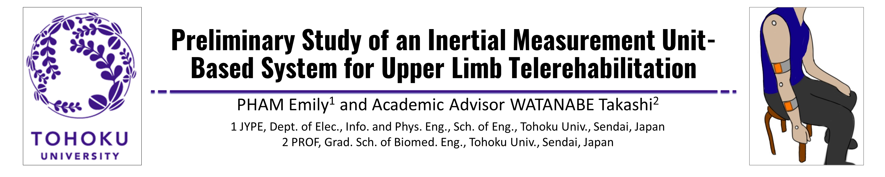

For the 2022-2023 Academic Year I participated in JYPE, the Junior Year Program in English at Tohoku University. Located in Sendai, Japan, Tohoku University is one of Japan's top research institute, and as part of my exchange program I was able to conduct research as a member of [Watanabe Laboratory](https://www.ecei.tohoku.ac.jp/fes/English/index_eng.html).
 

Currently, the research focus of Watanabe Lab is studying the application of various biomedical devices in rehabilitation and daily life of patients living with paralysis. My particular research focus was on the use of Inertial Measurement Units (IMUs) to quantify movement of the upper limb. This system would enable tracking of patient progress during at-home rehabilitation. 

Source: available upon request
