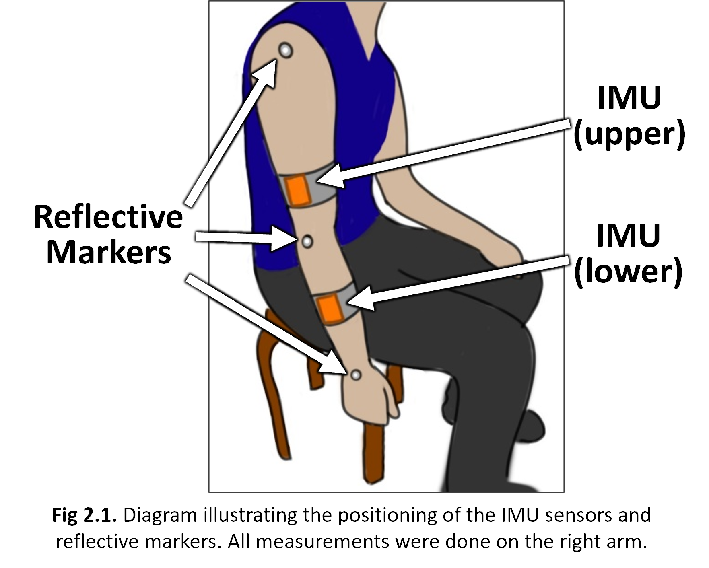
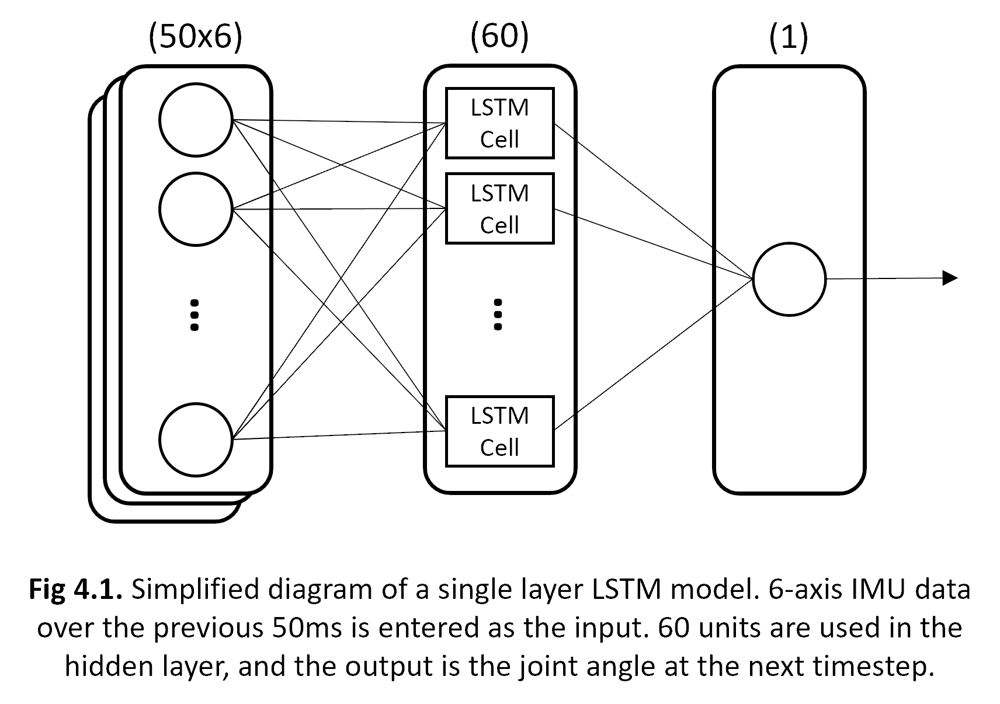

For the 2022-2023 Academic Year I participated in JYPE, the Junior Year Program in English at Tohoku University. Located in Sendai, Japan, Tohoku University is one of Japan's top research institute, and as part of my exchange program I was able to conduct research as a member of [Watanabe Laboratory](https://www.ecei.tohoku.ac.jp/fes/English/index_eng.html).
Currently, the research focus of Watanabe Lab is studying the application of various biomedical devices in rehabilitation and daily life of patients living with paralysis. My particular research focus was on the use of Inertial Measurement Units (IMUs) to quantify movement of the upper limb. This system would enable tracking of patient progress during at-home rehabilitation. 

## Joint Angle Measurement with IMUs

The first part of my research focused on the validation of the dual IMU system illustrated in figure 2.1. The acceleration and angular velocity measured with the IMUs, shoulder and elbow joint angles were calculated. Using the 3-D positional data recorded with the motion capture system, positional vectors, and thereby joint angles were also obtained. The angle measurements were synchronized, then Root Mean Square Error (RMSE) and Pearson correlation coefficients were used for comparison. 

Starting with code from one of my seniors in the laboratory, I used a combination of MatLab and python to perform these calculations. THe final data was exported to Excel where the visuals were generated.

## Angle Estimation with LSTM

The second part of my researched aimed at decreasing the necessary IMUs to one in order to decrease cost while improve ease-of-use. When only using the lower IMU, estimation of the joint angles must be performed. Utilizing the pandas and tensorflow packages in Python, I designed an LSTM based on a fellow lab mate's work. While the final results are not ideal, they suggest the feasibility of this method. The accuracy of the LSTM model is expected to improve with future refinements.

Source: available upon request
