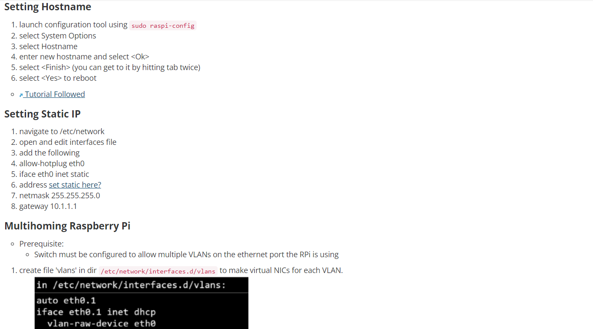

Taken from our homepage:
<blockquote>
    
"We are going to stand up a small, remote SCADA system.  Students will familiarize themselves with the equipment, design & build the lab, then analyze and identify critical cyber terrain.  Based on this analysis, students will deploy sensors on the remote network to flow data to a signature-based IDS (Intrusion Detection System).  As a class, we will then use AI/ML techniques to automatically create both permissive and restrictive signatures on the remote SCADA network.
    

    

    A second goal of this lab is to explore tools, techniques and procedures for administering legacy SCADA equipment using Zero-Trust processes."
    

</blockquote>

SCADA stands for 'Supervisory Control and Data Acquisition,' and it represents a type of control system architecture. During my time in the lab, I served as one of two Linux system administrators. We were tasked with programming and maintaining a multitude of Raspberry Pis that acted as access points within our system. For example, we setup some Pis to be our DHCP, DNS and NTP servers. On our lab's wiki, we created and maintained all documentation relevant to our work. A sample of one of the pages is given in the image below.

Source: available upon request
