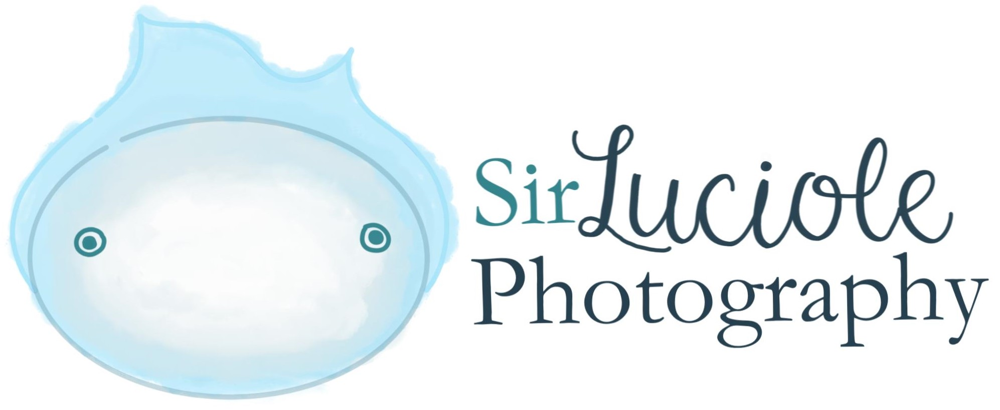
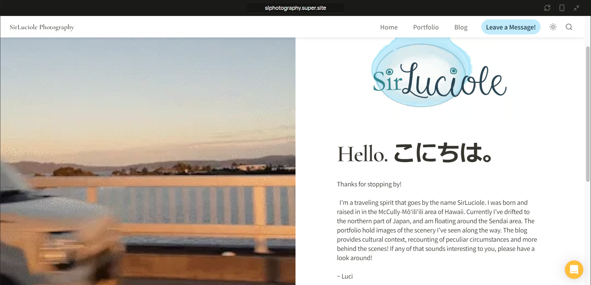

SirLuciole Photography is a site I built using a combination of Notion and Super.so. The goal of my site is to share my experience and thoughts during my exchange in Sendai. Japan. I hope those who visit my page are inspired to visit Japan or even participate in one of the many exchange programs offered to university students. 

Notion is a streamlined note taking application. Using its built-in tools I created the various pages of my site. These pages are then imported to Super.so where I can apply various themes and add custom css formatting. The site is also published through Super.so. It is still a work in progress, but a basic version of the site can be view at the link below.

Source: <a href="https://slphotography.super.site/">slphotography.super.site/</a>
